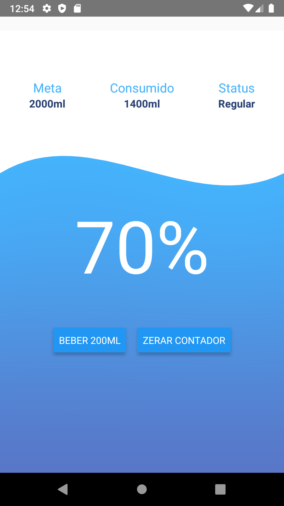

<h1 align="center">Welcome to app-water-counter 👋</h1>
<p>
  
</p>

### 🏠 [Homepage](React-native app that counts the amount of water needed and ingested per day.)
<p>
  
</p>

## Install

```sh
yarn install
```

## Usage

```sh
react-native run-android
```

## Author

👤 **Christopher Moura  **

* Github: [@ccmoura  ](https://github.com/ccmoura  )
* LinkedIn: [@ccmoura  ](https://linkedin.com/in/ccmoura  )

_This README was generated with ❤️ by [readme-md-generator](https://github.com/kefranabg/readme-md-generator)_